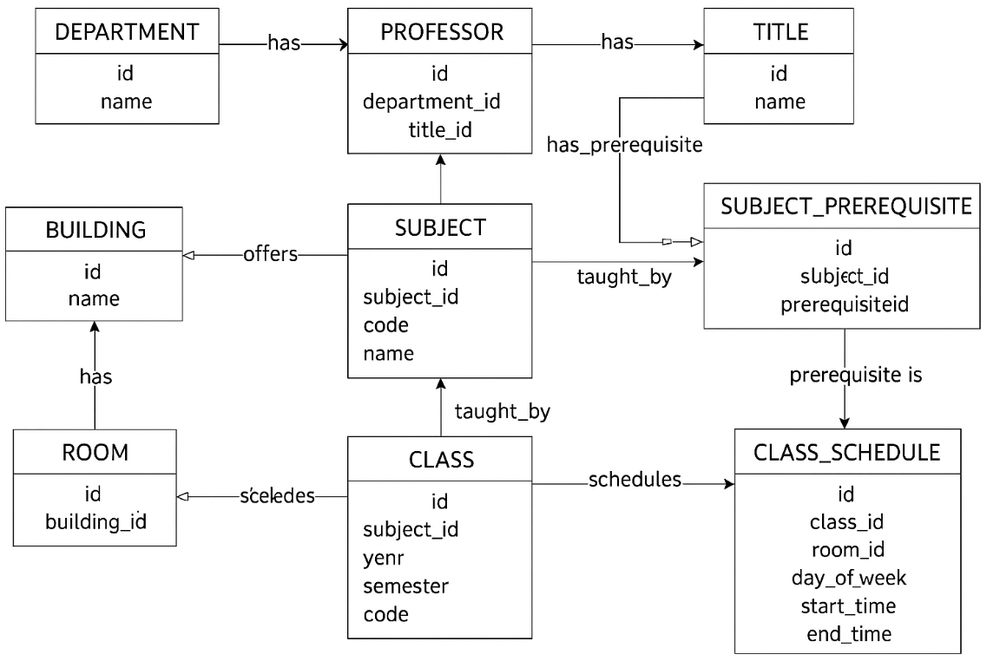

# Exercicio 2 - Construção de Queries

Obter dados através de queries construidas com base no ERD abaixo:



## Query 1:

Obter a quantidade de horas que cada professor tem comprometido em aulas

- Não é possível obter os dados desejados através da modelagem atual, pois a tabela `PROFESSOR` não possui nenhuma associação com `CLASS`.

Para tornar possível a obtenção dos dados, é necessário criar tabela com sua respectiva dependência:

```sql
CREATE TABLE public."CLASS_PROFESSOR" (
    id SERIAL PRIMARY KEY,
    class_id INTEGER NOT NULL REFERENCES public."CLASS"(id),
    professor_id INTEGER NOT NULL REFERENCES public."PROFESSOR"(id)
);
```

Após popular as tabelas, o resultado pode ser obtido através da consulta abaixo:

```sql

SELECT
    p.id AS professor_id,
    t.name AS titulo,
    SUM(EXTRACT(EPOCH FROM (cs.end_time - cs.start_time))/3600) AS total_horas
FROM public."PROFESSOR" p
JOIN public."CLASS_PROFESSOR" cp ON cp.professor_id = p.id
JOIN public."CLASS_SCHEDULE" cs ON cs.class_id = cp.class_id
JOIN public."TITLE" t ON t.id = p.title_id
GROUP BY p.id, t.name
ORDER BY total_horas DESC;

```

Para tornar possível a obtenção dos dados, é necessário criar tabela com sua respectiva dependência:

```sql
CREATE TABLE public."CLASS_PROFESSOR" (
    id SERIAL PRIMARY KEY,
    class_id INTEGER NOT NULL REFERENCES public."CLASS"(id),
    professor_id INTEGER NOT NULL REFERENCES public."PROFESSOR"(id)
);
```

Após a tabela criada, é possível obter os dados através da consulta:

```sql
SELECT
    p.id AS professor_id,
    t.name AS titulo,
    SUM(EXTRACT(EPOCH FROM (cs.end_time - cs.start_time))/3600) AS total_horas
FROM public."PROFESSOR" p
JOIN public."CLASS_PROFESSOR" cp ON cp.professor_id = p.id
JOIN public."CLASS_SCHEDULE" cs ON cs.class_id = cp.class_id
JOIN public."TITLE" t ON t.id = p.title_id
GROUP BY p.id, t.name
ORDER BY total_horas DESC;
```

## Query 2

- Listar salas com horários livres e ocupados

```sql
SELECT
    r.id AS room_id,
    b.name AS building,
    cs.day_of_week,
    cs.start_time,
    cs.end_time,
    c.code AS class_code,
    s.name AS subject_name
FROM public."ROOM" r
JOIN public."BUILDING" b ON r.building_id = b.id
LEFT JOIN public."CLASS_SCHEDULE" cs ON cs.room_id = r.id
LEFT JOIN public."CLASS" c ON cs.class_id = c.id
LEFT JOIN public."SUBJECT" s ON c.subject_id = s.id
ORDER BY r.id, cs.day_of_week, cs.start_time;
```
