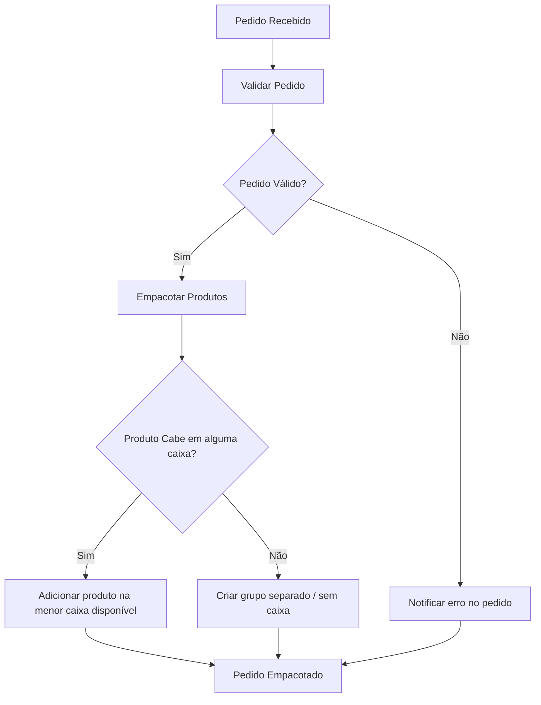

# Microsserviço de empacotamento

## Sumário

1. [Descrição](#descrição)
2. [Funcionalidades](#funcionalidades)
3. [Fluxo de empacotamento de pedidos](#fluxo-de-empacotamento-de-pedidos)
4. [Arquitetura e decisões técnicas - ADRs](#arquitetura-e-decisões-técnicas---adrs)
5. [Como executar a aplicação](#como-executar-a-aplicação)
   - [Pré-requisitos](#pré-requisitos)
   - [Rodando com Docker](#como-rodar-com-docker)
   - [Geração de token](#geração-de-token)
   - [Executando testes](#executando-testes)
6. [Swagger](#swagger)
7. [Observações](#observações)
8. [Exercício 2](#exercício-2)

## Descrição

API Web utilizando Node com NestJs que recebe, em formato JSON, uma lista de pedidos. Cada pedido contém uma lista de produtos, cada um com suas dimensões (altura, largura, comprimento).

A API processa cada pedido e determina a melhor forma de embalar os produtos, selecionando uma ou mais caixas para cada pedido e especificando quais produtos vão em cada caixa.

### Caixas disponíveis

- Caixa 1: 30 x 40 x 80
- Caixa 2: 50 x 50 x 40
- Caixa 3: 50 x 80 x 60

**Entrada:**

A API deve aceitar um JSON contendo N pedidos diferentes. Cada pedido deve ter entre N produtos. Cada produto deve incluir suas dimensões em centímetros (altura, largura, comprimento).

**Processamento:**

Para cada pedido, a API deve calcular a melhor forma de empacotar os produtos dentro das caixas de papelão disponíveis. Você poderá usar uma ou mais caixas de papelão para empacotar o pedido. Deve considerar a otimização do espaço, tentando minimizar o número de caixas de papelão a serem usadas.

**Saída:**

A API deve retornar um JSON que, para cada pedido, lista as caixas usadas e quais produtos foram colocados em cada caixa.

---

## Funcionalidades

- Empacotamento automático de produtos em caixas.
- Escolha da menor caixa possível.
- Suporte a múltiplos produtos e caixas por pedido.
- API com autenticação via JWT para microsserviços.
- Testes unitários cobrindo casos críticos.

## Fluxo de empacotamento de pedidos

O diagrama abaixo mostra o fluxo principal do serviço de empacotamento:



## Arquitetura e decisões técnicas - ADRs

Para explicar as decisões de arquitetura, algoritmo, testes e modelagem, consultamos os ADRs a seguir:

| ADR | Assunto                                              | Link                                                                                |
| --- | ---------------------------------------------------- | ----------------------------------------------------------------------------------- |
| 001 | Arquitetura com domínio rico                         | [ADR 001 – Domínio Rico](docs/adrs/001-dominios-ricos.md)                           |
| 002 | Implementação do algoritmo de empacotamento          | [ADR 002 – Algoritmo de Empacotamento](docs/adrs/002-algoritmo-empacotamento.md)    |
| 003 | Cobretura de testes e localização dos arquivos       | [ADR 003 – Cobertura de testes](docs/adrs/003-cobertura-testes.md)                  |
| 004 | Decisão de deixar caixas no código ao invés do banco | [ADR 004 – Caixas definidas no código](docs/adrs/004-caixas-definidas-no-codigo.md) |

> **Observação:** Os arquivos de ADRs estão localizados em `docs/adrs/` para manter histórico de decisões e permitir fácil consulta futura.

---

## Como executar a aplicação

A aplicação é distribuída como container Docker, garantindo que todos os ambientes sejam consistentes.

### Pré-requisitos

- Docker (Desktop ou Engine)
- Docker Compose
- Node.js (para desenvolvimento local, opcional se for rodar tudo via Docker)

### Como Rodar com Docker

0. Renomear o arquivo `env-example` para `.env` e preencher a variável `MICROSERVICE_JWT_SECRET` com o valor desejado. Esta variável é necessária para compor o token de autenticação.

1. **Build e start do container:**

```bash
docker-compose up --build -d
```

> O --build garante que a imagem seja reconstruída caso haja alterações no código.

2. Verificar container rodando

```bash
docker ps
```

- O container principal deve estar com o nome definido no `docker-compose.yml`: `empacotamento_service` e a porta `3000` exposta.

3. Parando o container

```bash
docker-compose down
```

### Geração de token

Como requisito, a aplicação gera um token para autenticar outros microsserviços.

1. Para criar um novo token através do container:

```bash
docker exec -it empacotamento_service node dist/generate-token.js empacotamento`
```

> Este comando utiliza o script generate-token.js dentro do container para criar um token JWT válido.

### Executando testes

Para rodar os testes dentro do container:

1. Acessar o container

```bash
docker exec -it empacotamento_service sh`
```

2. Rode os testes desejados

- Testes unitários: `npm run test`
- Testes e2e: `npm run test:e2e`

## Swagger

A API possui documentação interativa via Swagger, que pode ser acessada em:

```bash
http://localhost:3000/docs
```

No Swagger, é possível autenticar as requisições usando JWT:

- Clique no botão Authorize
- Insira o token gerado anteriormente

> Após autorizar, a rota protegida aceitará o JWT

### Observações

O Dockerfile segue o padrão Nest.js, compilando o TypeScript para dist/src/main.js.

- Para alterações no código, recomendo rebuild do container:

```bash
docker-compose up --build -d
```

- Logs do container podem ser acompanhados com:

```bash
docker logs -f empacotamento_service
```

---

### Exercício 2

A execução do exercício 2 está contida no arquivo:

[Execução](./EXERCICIO-2.md)
